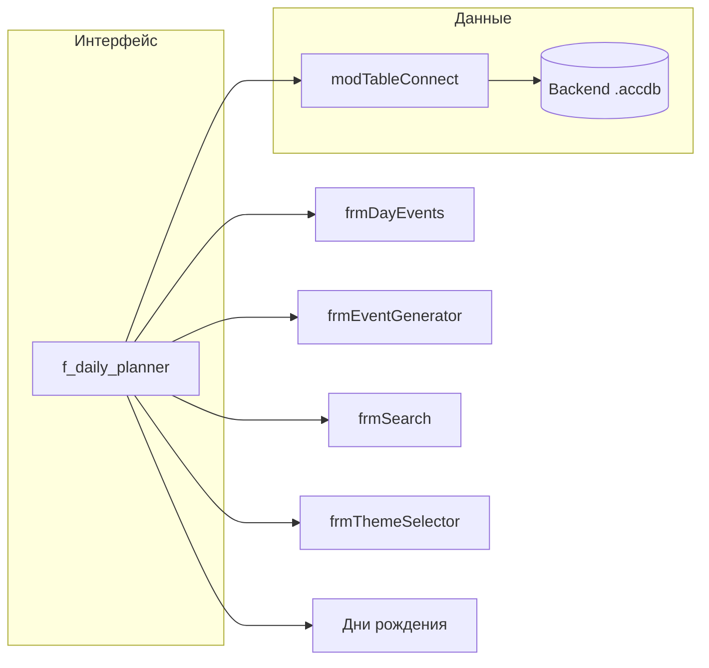
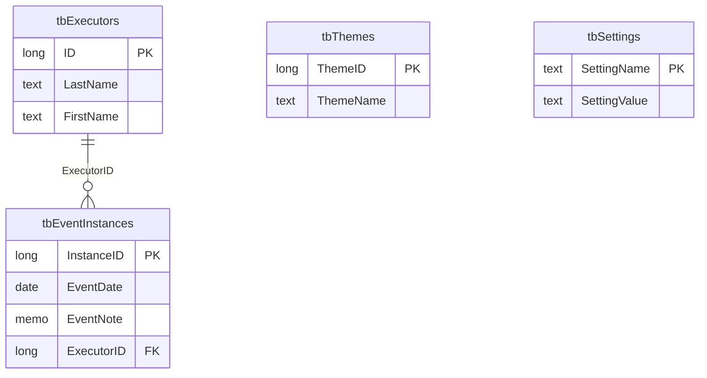

# VBA Access Planner

Настольный **ежедневник-календарь** на **Microsoft Access + VBA**: месячная сетка, события по дням, исполнители, повторяющиеся события, темы оформления, дни рождения, поиск. Архитектура **frontend / backend** (связанные таблицы).

> В репозитории — **исходники** (`DB_VBA/`, документация). Файлы **`*.accdb`** в Git не коммитятся (см. `.gitignore`); рабочую базу собираете локально из выгрузки или своей копии.

## Возможности

| Область | Что сделано |
|--------|-------------|
| **Календарь** | Месячная сетка, «сегодня», выходные, переход по месяцам |
| **События** | Список на день, редактирование, выполнение, вложения |
| **Исполнители** | Справочник, фильтр на главной форме |
| **Генератор** | Повторы (день / неделя / месяц / квартал / полгод / год), черновик в `tbTempEvents`, запись в `tbEventInstances` |
| **Поиск** | Фильтры по дате, тексту, исполнителю, статусу, вложениям |
| **Темы** | Цветовые схемы из БД + палитра для отчётов (`modThemeColors`) |
| **Дни рождения** | Список, карточка, панель на главной, отчёт `rptBirthdays` |
| **Админ** | Пароль, форма администратора |
| **Защита** | Привязка к ПК (лицензия), настройки в `tbSettings` |
| **Инфраструктура** | Автоподключение к BE, экспорт VBA в файлы, класс `cLogger`, диагностические модули |

Точка входа UI — форма **`f_daily_planner`**.

## Схема подсистем (упрощённо)



## Ядро модели данных



Полное описание таблиц и полей: [`docs/planner-report-02-data-model.md`](docs/planner-report-02-data-model.md).

## Структура репозитория

| Путь | Назначение |
|------|------------|
| [`DB_VBA/VBA_Modules/`](DB_VBA/VBA_Modules/) | Стандартные модули |
| [`DB_VBA/VBA_FormCode/`](DB_VBA/VBA_FormCode/) | Код форм |
| [`DB_VBA/VBA_Classes/`](DB_VBA/VBA_Classes/) | Классы (в т.ч. `cLogger`) |
| [`DB_VBA/VBA_Tables/`](DB_VBA/VBA_Tables/) | JSON-схемы таблиц |
| [`DB_VBA/VBA_Forms/`](DB_VBA/VBA_Forms/) | Разметка форм (текст) |
| [`docs/`](docs/) | Обзор, модель данных, формы, машинный индекс |

## Документация

- [Обзор приложения](docs/planner-report-01-overview.md)
- [Модель данных](docs/planner-report-02-data-model.md)
- [Формы и отчёты](docs/planner-report-03-forms-and-reports.md)

## Скриншот (опционально)

Чтобы на главной странице GitHub была картинка интерфейса, положите файл, например `docs/images/planner-main.png`, и раскомментируйте строку ниже в этом README:

```markdown

```

## Требования

- Microsoft Access (настольная версия, VBA + DAO)
- Windows (WMI / FSO в коде защиты и утилит)

## Лицензия

Уточните при публикации (если репозиторий публичный).
