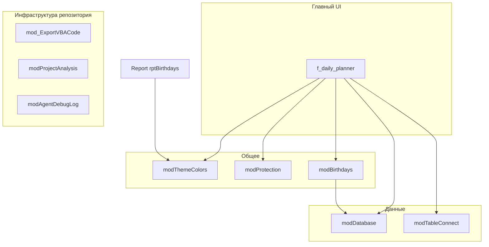

# Planner: обзор приложения (VBA / Access)

Документ описывает назначение и архитектуру по выгрузке в [`DB_VBA`](../DB_VBA). Бинарные `.accdb` в анализ не входят.

## Назначение

Настольное приложение **ежедневного календаря-планировщика** на Microsoft Access:

- Месячная сетка с событиями по дням, навигация по месяцам, выделение «сегодня» и выходных.
- Учёт **исполнителей**, **фильтр по исполнителю**, опция **скрывать выполненные** события.
- **Генератор повторяющихся событий** (ежедневно, еженедельно, ежемесячно, квартал, полгод, год) с предпросмотром в `tbTempEvents` и переносом в `tbEventInstances`.
- **Темы оформления** (цвета календаря, заголовка, формы) из `tbThemes`; общая палитра дублируется в модуль [`modThemeColors.bas`](../DB_VBA/VBA_Modules/modThemeColors.bas) для отчётов.
- **Дни рождения**: справочник в `tbBirthdays` (backend), формы списка/карточки, боковая панель на главной форме и отчёт `rptBirthdays` (SQL создаётся в коде).
- **Лицензирование / привязка к ПК**: [`modProtection.bas`](../DB_VBA/VBA_Modules/modProtection.bas) — хэш от MAC, диска, имени машины; ключи в `tbSettings`; при несовпадении — `Application.Quit`.
- **Разделение FE/BE**: связанные таблицы, пути в `tbTableConnections`, автоподключение при старте [`modTableConnect.bas`](../DB_VBA/VBA_Modules/modTableConnect.bas).

## Точка входа и стартовая форма

Основной UI — форма **`f_daily_planner`** ([`Form_f_daily_planner.bas`](../DB_VBA/VBA_FormCode/Form_f_daily_planner.bas)). В типичном сценарии она открывается при запуске базы (настройка «отображать при открытии» задаётся в Access, в экспорте не видна).

При `Form_Load`:

1. `CheckLicenseOnStartup` — лицензия.
2. `AutoConnectOnStartup` — подключение таблиц к backend.
3. Загрузка месяца, темы, настроек `HideCompleted`, `ShowBirthdaysPanel`, фильтра исполнителей.
4. `BuildCalendar` — отрисовка сетки и данных.

## Карта подсистем

| Подсистема | Файлы / объекты |
|------------|-----------------|
| Календарь и настройки UI | `Form_f_daily_planner.bas`, `modThemeColors.bas` |
| Данные и DDL | `modDatabase.bas` (создание таблиц, миграции, служебные процедуры) |
| Подключение к BE | `modTableConnect.bas` |
| События по дню | `Form_frmDayEvents.bas` ↔ `tbEventInstances` |
| Поиск | `Form_frmSearch.bas` |
| Генератор событий | `Form_frmEventGenerator.bas`, `tbTempEvents`, `tbPeriodicity`, `tbRules` |
| Исполнители | `Form_frmExecutors.bas`, `tbExecutors` |
| Дни рождения | `modBirthdays.bas`, `Form_frmBirthdaysList.bas`, `Form_frmBirthdayCard.bas`, `Report_rptBirthdays.bas` |
| Темы (выбор) | `Form_frmThemeSelector.bas` → вызывает `Forms!f_daily_planner.ApplyTheme` |
| Админ / пароль | `Form_frmPassword.bas`, `Form_frmAdmin.bas`, `modProtection` (`SetAdminPassword`, проверка пароля) |
| Демо-тур | `Form_frmDemo.bas`, вспомогательно `modDemo.bas` |
| Очистка данных / режим конструктора | `modClearTable.bas` |
| Экспорт исходников в репозиторий | `mod_ExportVBACode.bas` |
| Диагностика проекта | `modProjectAnalysis.bas` |
| Логи агента (JSON) | `modAgentDebugLog.bas` |
| Логирование в файл | класс `cLogger.cls` |

## Зависимости модулей (упрощённо)

Формы открывают друг друга через `DoCmd.OpenForm` (см. отчёт по формам). `mod_ExportVBACode`, `modProjectAnalysis`, `modAgentDebugLog` не обязаны присутствовать в релизе для конечного пользователя — это инструменты разработки и синхронизации с Git.

## Структура выгрузки `DB_VBA`

| Папка | Содержимое |
|-------|------------|
| `VBA_Modules` | Стандартные модули `.bas` |
| `VBA_FormCode` | Код классов форм (имена файлов `Form_<FormName>.bas`) |
| `VBA_FormControls` | JSON описания контролов |
| `VBA_ReportCode` | Код отчёта `.bas` + вспомогательный `.txt` |
| `VBA_ReportControls` | JSON контролов отчёта |
| `VBA_Tables` | JSON схем таблиц (поля, индексы) |
| `VBA_Classes` | class modules `.cls` |
| `Migrations` | Текстовые инструкции миграций |
| `reference` | Справочные материалы (например YAML свойств Access) |

## Внешние зависимости (из кода)

- **DAO** (`DAO.Database`, `Recordset`) — работа с таблицами.
- **WMI** (`winmgmts`) — MAC-адрес, серийный номер диска в `modProtection`.
- **FileSystemObject** — пути, экспорт файлов в `mod_ExportVBACode`.

## Связанные отчёты

- [Модель данных](planner-report-02-data-model.md)
- [Формы и отчёты](planner-report-03-forms-and-reports.md)
- [Машинный индекс](planner-report-04-machine-index.yaml)
